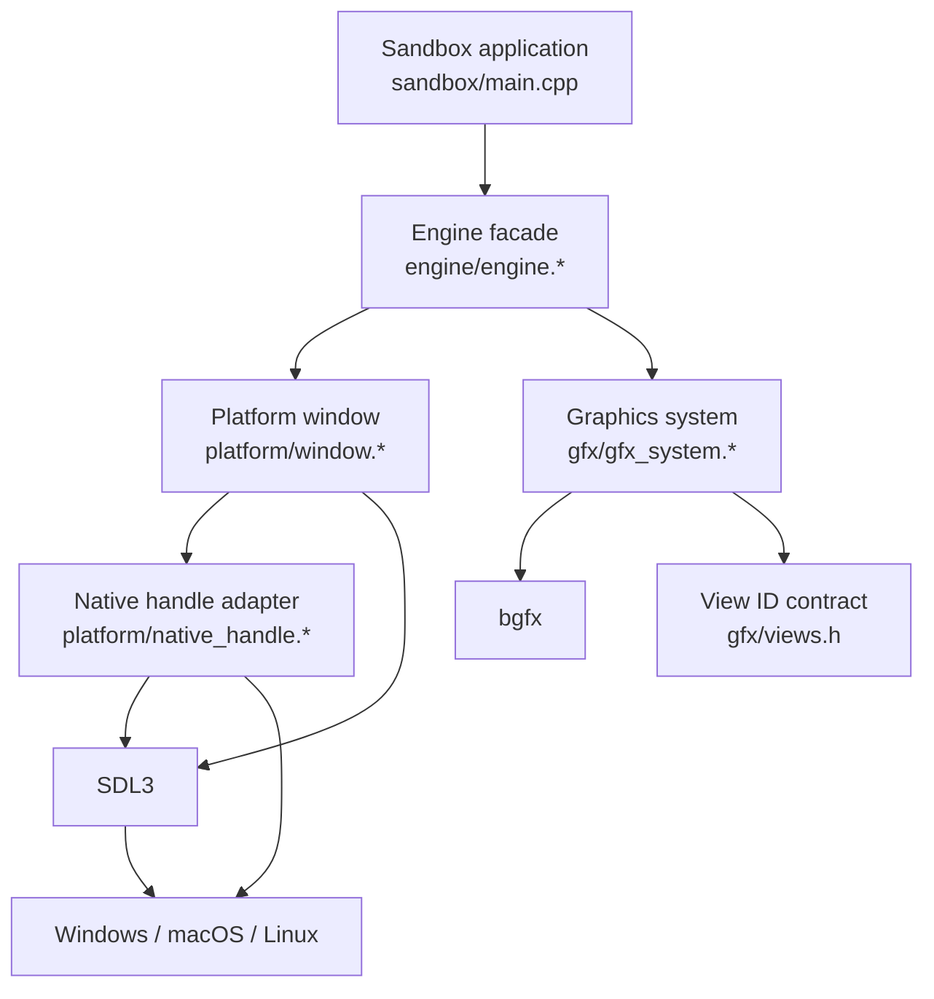

# Hephaestus Architecture

## 1. Project Overview

Hephaestus is a small cross-platform C++20 engine foundation for Windows, Linux, and macOS. It combines:

- **SDL3** for window creation, input/event delivery, display sizing, and platform discovery.
- **bgfx** for renderer abstraction and graphics backend selection.
- **CMake + Ninja** for configuration and builds.
- **The `sandbox` executable** as the current application and integration harness.

The project is intentionally small. The engine currently establishes a native window, initializes bgfx against that window, runs a frame loop, displays diagnostic text, handles resizing, and shuts down cleanly. Gameplay, resource management, scene management, and a full rendering pipeline are future layers rather than current responsibilities.

## 2. High-Level Structure



The dependency direction is one-way at the engine boundary:

```text
sandbox -> engine -> {SDL3, bgfx/bx}
```

The application does not need to know how SDL obtains native handles or which renderer bgfx selects. Platform-specific code is isolated in `platform/native_handle.cpp`, while graphics setup is isolated in `gfx/gfx_system.cpp`.

## 3. Repository Layout

| Path | Responsibility |
|---|---|
| `CMakeLists.txt` | Root project settings, language standard, output directories, and third-party targets. |
| `CMakePresets.json` | Ninja configure/build presets for Debug, RelWithDebInfo, and AddressSanitizer/UndefinedBehaviorSanitizer. |
| `engine/` | Static engine library. |
| `engine/engine.*` | Public engine lifecycle facade and frame orchestration. |
| `engine/core/` | Fixed-width types, logging, and assertions. |
| `engine/platform/` | SDL window ownership, events, resize state, and native window handle extraction. |
| `engine/gfx/` | bgfx initialization, reset/resize behavior, frame submission, and reserved view IDs. |
| `sandbox/` | Executable entry point used to exercise the engine. |
| `shaders/` | bgfx shader build configuration and varying definition. This is not currently added by the root CMake file. |
| `third_party/SDL/` | SDL3 dependency. |
| `third_party/bgfx.cmake/` | bgfx, bx, bimg, and CMake integration. |
| `third_party/imgui/` | Vendored Dear ImGui sources; currently not linked into the engine target. |
| `build/` | Generated CMake/Ninja output. It is not source code. |
| `cmd_*.sh` | Convenience commands for repository initialization and local platform setup. |
| `.githooks/` | Optional repository hooks configured through `core.hooksPath`. |

## 4. CMake Targets and Build Configuration

The root project is named `MyEngine` and requires CMake 3.25 or newer. It uses C++20 with extensions disabled and exports `compile_commands.json`.

### Targets

- **`engine`**: A static library containing the core, platform, graphics, and lifecycle code.
- **`sandbox`**: An executable linked privately to `engine`. It is the current runnable application.
- **Third-party targets**: bgfx/bx and SDL3 targets supplied by their respective CMake projects.
- **`engine_shaders`**: Defined by `shaders/CMakeLists.txt`, but currently not reachable because the root `CMakeLists.txt` does not call `add_subdirectory(shaders)`.

Runtime binaries are configured under `${CMAKE_BINARY_DIR}/bin` for all configurations. With the checked-in presets, the expected executable is:

```text
build/debug/bin/sandbox
```

### Presets

- `debug`: Debug build.
- `release`: `RelWithDebInfo` build.
- `asan`: Debug build with AddressSanitizer and UndefinedBehaviorSanitizer on non-Windows hosts.

Typical commands:

```bash
cmake --preset debug
cmake --build --preset debug
./build/debug/bin/sandbox
```

The repository uses Ninja through the presets. Windows additionally receives `/W4`, `/permissive-`, and console-subsystem settings; other platforms receive `-Wall -Wextra -Wpedantic`.

## 5. Runtime Ownership and Lifecycle

`eng::Engine` owns one `platform::Window` and one `gfx::GfxSystem`. Initialization and shutdown are deliberately symmetric.

### Initialization

1. `sandbox/main.cpp` calls `SDL_SetMainReady()` because the application supplies its own `main` function.
2. The sandbox fills an `EngineDesc` with title, pixel dimensions, and vsync preference.
3. `Engine::Init` converts the description into a `WindowDesc` and calls `Window::Init`.
4. `Window::Init` initializes SDL video, creates a high-DPI SDL window, reads the drawable pixel size, and extracts native handles.
5. `Engine::Init` converts those handles into a `GfxDesc` and calls `GfxSystem::Init`.
6. `GfxSystem::Init` configures bgfx, selects the platform renderer automatically, sets the reset flags, and configures the opaque view.
7. If graphics initialization fails, the engine destroys the window before returning failure.

The initialization dependency is therefore:

```text
SDL video -> SDL window -> native handles -> bgfx -> Engine ready
```

### Main loop

`Engine::Run` returns immediately when initialization has not succeeded. Otherwise, each iteration:

1. Drains SDL events with `Window::PumpEvents`.
2. Stops on a quit event, window-close request, or Escape key press.
3. Computes delta time using SDL's high-resolution performance counter.
4. Applies a pending pixel-size change to bgfx through `GfxSystem::Resize`.
5. Calls `Frame(deltaSeconds)`.
6. `Frame` begins the graphics frame, writes bgfx debug text, and ends the frame with `bgfx::frame()`.

The current frame only renders diagnostic text:

- Engine label.
- Selected bgfx renderer name.
- Current drawable size and frame delta.
- Escape-to-quit hint.

### Shutdown

The sandbox calls `Engine::Shutdown` after `Run` returns. Shutdown happens in reverse initialization order:

```text
bgfx::shutdown() -> SDL_DestroyWindow() -> SDL_Quit()
```

Both `Window` and `GfxSystem` also have destructors that call `Shutdown`, making their cleanup idempotent when their ownership is used directly. The engine itself guards shutdown with `m_initialized`.

## 6. Platform Layer

### Window ownership

`platform::Window` owns the SDL video subsystem and the `SDL_Window*` it creates. It tracks:

- Current drawable width and height in pixels.
- Whether a pixel-size event has occurred since the previous frame.
- Whether the application should continue running.
- Whether this object initialized SDL and must call `SDL_Quit`.

Copying is disabled because the class owns native resources.

### Events and resize

`Window::PumpEvents` handles the events needed by the current foundation:

- `SDL_EVENT_QUIT`.
- `SDL_EVENT_WINDOW_CLOSE_REQUESTED` for the active window.
- `SDL_EVENT_WINDOW_PIXEL_SIZE_CHANGED`.
- `SDL_EVENT_KEY_DOWN` for Escape.

Resize is a one-frame signal. `ConsumeResize()` returns the current flag and clears it. The engine then calls `GfxSystem::Resize`, which ignores zero-sized minimized windows and avoids redundant bgfx resets.

### Native handles

`platform::Query` translates SDL window properties into the handles expected by bgfx:

| Platform | Window handle | Display handle |
|---|---|---|
| Windows | Win32 `HWND` | None |
| macOS | Cocoa `NSWindow*` | None |
| Linux/FreeBSD with Wayland | Wayland surface | Wayland display |
| Linux/FreeBSD with X11 | X11 window number | X11 display |

A missing window handle is treated as a fatal initialization error for the current graphics path. On Linux and FreeBSD, the graphics layer also passes the Wayland native-window type to bgfx when appropriate.

## 7. Graphics Layer

`gfx::GfxSystem` is the engine-owned boundary around bgfx. It does not expose bgfx initialization details to the application.

### Initialization contract

- A valid native window handle is required.
- The renderer type is set to `Count`, allowing bgfx to choose the backend.
- The requested width, height, and vsync flag become bgfx resolution/reset settings.
- `bgfx::renderFrame()` is called before `bgfx::init()` to force single-threaded rendering for simpler debugging.
- Debug text is enabled with `BGFX_DEBUG_TEXT`.
- The opaque view is named and configured to clear color and depth buffers.

### Per-frame contract

`BeginFrame` sets the opaque view rectangle to the current drawable dimensions and calls `bgfx::touch` so the view is cleared even when no draw calls are submitted. Application rendering can be added between `BeginFrame` and `EndFrame` as the engine grows.

`EndFrame` submits queued work and advances bgfx with `bgfx::frame()`.

### View IDs

`gfx/views.h` reserves stable IDs for future passes:

| ID | View |
|---:|---|
| 0 | Shadow |
| 10 | Opaque |
| 20 | Skybox |
| 30 | Transparent |
| 100 | Post-processing |
| 200 | Debug draw |
| 255 | UI |

The gaps are intentional: later rendering passes can be introduced without renumbering existing contracts.

## 8. Core Utilities

- `core/types.h` defines project aliases such as `u32`, `u64`, `f32`, and `f64` using standard fixed-width types.
- `core/log.h/.cpp` provides formatted trace, info, warning, and error logging. Messages include a severity tag, basename, source line, and are flushed immediately.
- `core/assert.h` defines `ENGINE_ASSERT`. In non-release builds it logs, traps, and stops execution; in release builds it reduces to a condition-size expression.

These utilities have no dependency on the application layer and are available to all engine modules.

## 9. Shaders and Assets

The shader CMake module describes a bgfx shader pipeline for `vs_mesh.sc` and `fs_mesh.sc`, using `varying.def.sc` and bgfx include directories. It writes generated shader binaries below `${CMAKE_BINARY_DIR}/shaders` and owns them through an `engine_shaders` custom target.

Current repository state:

- `shaders/varying.def.sc` exists.
- `shaders/vs_mesh.sc` and `shaders/fs_mesh.sc` are not currently present.
- `shaders/CMakeLists.txt` is not included from the root build.

Before relying on shader compilation, add the mesh shader sources and wire `add_subdirectory(shaders)` into the root CMake configuration. The generated shader output should then be treated as build output, not committed source.

## 10. Third-Party Boundaries

- **SDL3** is linked statically as `SDL3::SDL3-static` and is used by the platform layer and sandbox entry point.
- **bgfx** and **bx** are linked publicly by `engine` because the current public graphics headers include bgfx types and native graphics concepts.
- **bimg** is supplied by the bgfx dependency tree but is not yet used directly by engine code.
- **Dear ImGui** is vendored under `third_party/imgui` but is not currently a CMake target or runtime dependency.

Third-party source should remain isolated under `third_party/`; engine code should depend on it through the target/link interfaces defined by CMake.

## 11. Error Handling and Failure Boundaries

Initialization methods return `bool` and log details at the point of failure. The current failure boundaries are:

- SDL video initialization failure.
- SDL window creation failure.
- Native handle discovery failure.
- bgfx initialization failure.

When a later initialization step fails, earlier owned resources are released before returning. The sandbox maps an engine initialization failure to process exit code `1`.

The current loop is intentionally synchronous and has no task system, exception-based error flow, or recovery path for renderer loss.

## 12. Extension Points

The natural next layers are:

1. Add a renderer/resource abstraction above raw bgfx handles.
2. Add shader source files and connect the shader target to the main build.
3. Add vertex/index buffers, uniforms, textures, and a first mesh pass using the reserved opaque view.
4. Introduce an asset or resource manager for generated shader binaries and image data.
5. Add an input abstraction so gameplay code does not consume SDL events directly.
6. Add an application interface or scene layer above `Engine` while keeping `sandbox` as a thin host.
7. Integrate Dear ImGui through a deliberate CMake target and a renderer/platform backend.
8. Add automated tests for platform-independent core code and a smoke test for initialization where a graphics environment is available.

New systems should preserve the existing ownership direction: the application requests engine behavior, the engine coordinates subsystems, and platform/graphics details stay behind their respective interfaces.

## 13. Development Checks

After changing C++ code, use the configured build as the primary smoke check:

```bash
cmake --build --preset debug
```

For sanitizer-supported hosts:

```bash
cmake --preset asan
cmake --build --preset asan
```

Enable the repository hooks once per clone:

```bash
git config core.hooksPath .githooks
```

The pre-commit checks inspect staged C and C++ files for whitespace, indentation, and brace-style issues.
